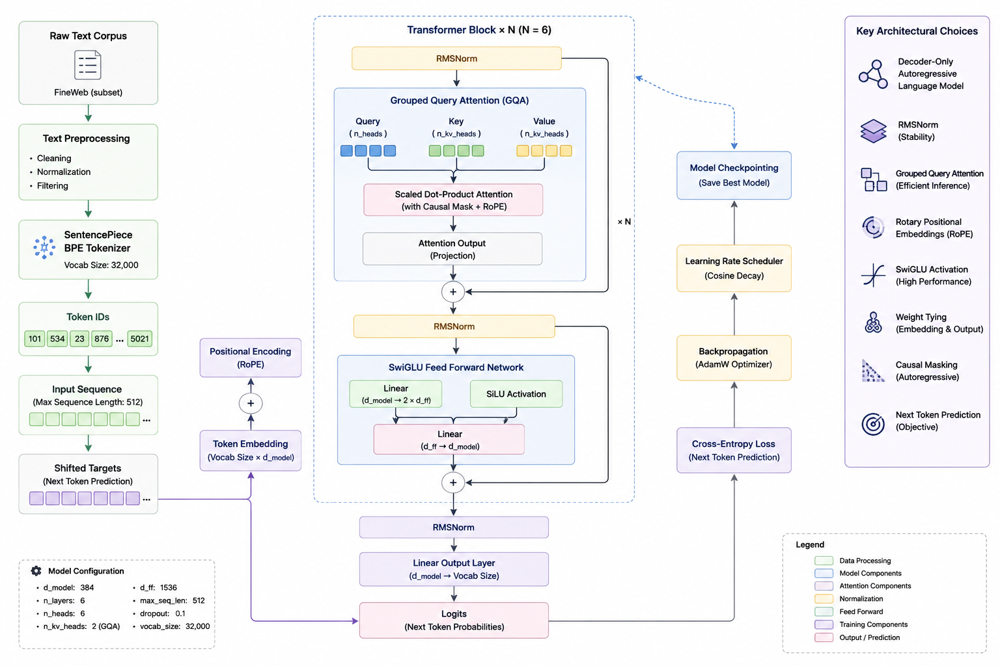

# SyntaxLM



SyntaxLM is a decoder-only Transformer language model implemented and trained from scratch using PyTorch.

The project was built to understand the internal mechanics of modern language models including tokenizer training, autoregressive next-token prediction, Transformer architecture design, optimization, checkpointing, and text generation.

The model was trained on a curated subset of the FineWeb dataset using a custom SentencePiece BPE tokenizer.

---

# Model Overview

SyntaxLM uses a modern decoder-only Transformer architecture with:

* RMSNorm
* Rotary Positional Embeddings (RoPE)
* Grouped Query Attention (GQA)
* SwiGLU Feed Forward Networks
* Residual Connections
* Weight Tying
* Causal Self-Attention

The architecture follows a repeated Transformer decoder block structure optimized for autoregressive language modeling.

---

# Dataset

Training data was sourced from:

* FineWeb Dataset
  https://huggingface.co/datasets/HuggingFaceFW/fineweb

The dataset was cleaned, normalized, and converted into a text corpus before tokenizer training and tokenization.

---

# Tokenizer

SyntaxLM uses a custom SentencePiece BPE tokenizer.

Vocabulary size:

```python
32000
```

Special tokens:

```python
PAD = 0
UNK = 1
BOS = 2
EOS = 3
```

---

# Model Configuration

```python
{
    "vocab_size": 32000,
    "d_model": 384,
    "n_layers": 6,
    "n_heads": 6,
    "n_kv_heads": 2,
    "ffn_hidden": 1536,
    "max_seq_len": 512,
    "dropout": 0.1
}
```

---

# Transformer Block

Each Transformer decoder block follows:

```text
RMSNorm
↓
Grouped Query Attention + RoPE
↓
Residual Connection
↓
RMSNorm
↓
SwiGLU Feed Forward
↓
Residual Connection
```

Repeated across multiple layers.

---

# Training Pipeline

The training pipeline includes:

1. Data preprocessing and corpus creation
2. SentencePiece tokenizer training
3. Tokenization into integer token IDs
4. Autoregressive next-token prediction training
5. Mixed precision optimization and checkpointing
6. Autoregressive text generation

---

# Training Details

Training objective:

* autoregressive next-token prediction

Optimization:

* AdamW optimizer
* cosine learning rate scheduler
* mixed precision training
* gradient accumulation
* gradient clipping
* checkpoint saving

Loss function:

* CrossEntropy Loss

---

# Example Generations

Prompt:

```text
The history of artificial intelligence
```

Output:

```text
and the University of EVU, which is a “wo-in-the-of-creative in the United States" (Axk) was to be the same as a man.
```

---

Prompt:

```text
In machine learning, a neural network
```

Output:

```text
of the data is not a very well-piece and it can be used to ensure that its business may have been in some time.
```

---

Prompt:

```text
The transformer architecture was introduced
```

Output:

```text
in the first time, with a new state that has been made up to its company’s business. But I’m not sure this is what we have done.
```

---

# Files

| File                | Description                      |
| ------------------- | -------------------------------- |
| `devassist_best.pt` | Trained model weights            |
| `devassist.model`   | SentencePiece tokenizer model    |
| `devassist.vocab`   | Tokenizer vocabulary             |
| `config.json`       | Model configuration              |
| `architecture.png`  | Transformer architecture diagram |

---

# Tech Stack

* PyTorch
* SentencePiece
* NumPy
* Google Colab
* Hugging Face

---

# Project Goal

SyntaxLM was developed as an educational implementation of modern Transformer-based language models to better understand how large language models work internally.

The focus of the project is architectural understanding, training mechanics, and experimentation rather than production-scale conversational performance.

---

# Future Improvements

Planned future work includes:

* instruction tuning
* retrieval augmented generation (RAG)
* larger-scale datasets
* evaluation benchmarks
* quantized inference
* improved generation quality
